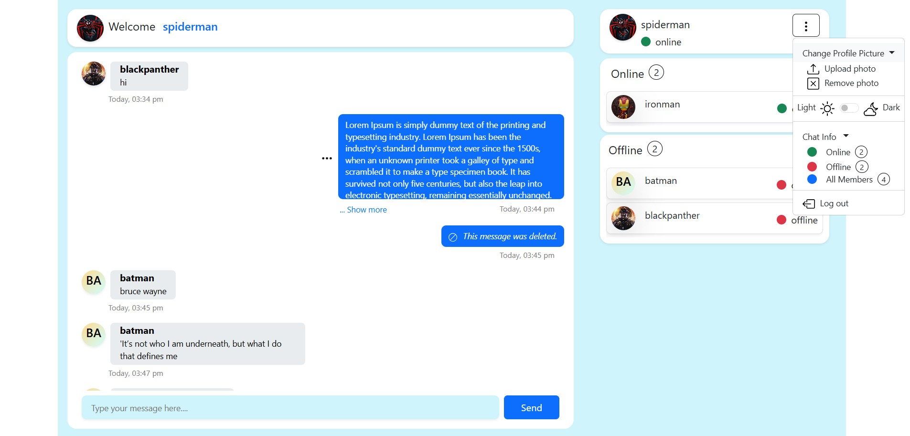
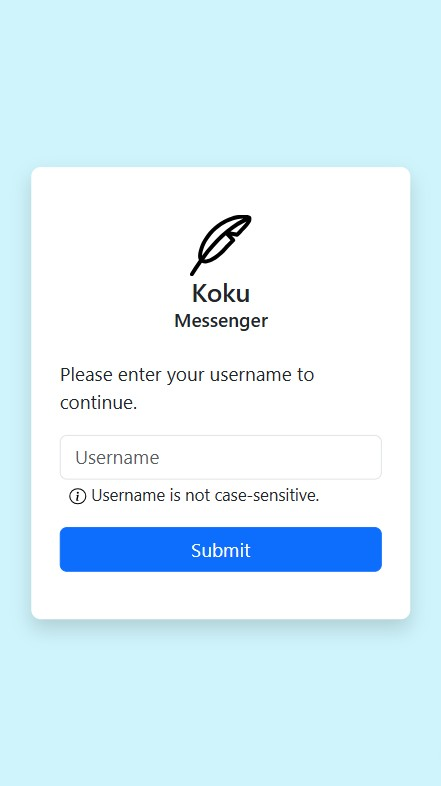
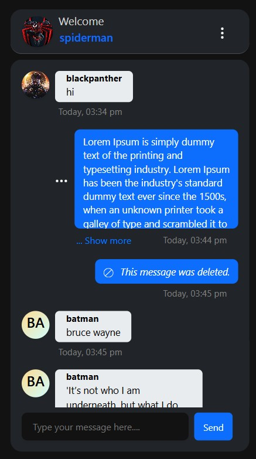
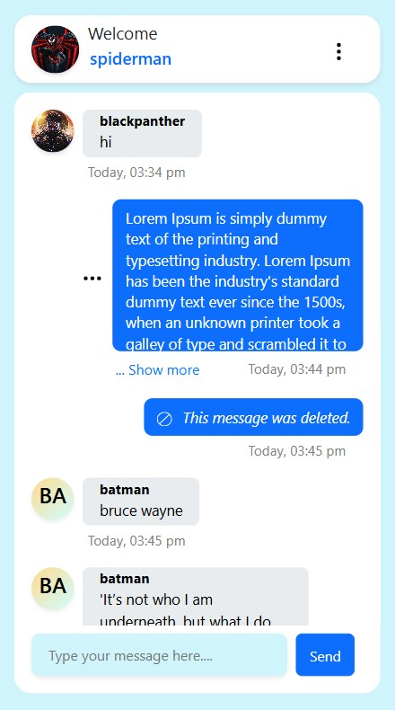

# Koku-Messenger

Koku-Messenger is a full-stack real-time chat application designed for modern messaging needs. It combines robust backend technologies with a clean and responsive frontend interface to deliver seamless communication between users.

## 🚀 Features

- 🔐 **Authentication & Session Management**
  - Secure **username-based login** using **JWT (JSON Web Tokens)**
  - Session handling with **cookie-parser**
  - 🔐 **Single Session Login (One Device at a Time)**
    - Users can only stay logged in on **one device at a time**
    - Logging in from a new device will **automatically log out** the previous session
  - 🔐 **Logout Options**
    - Logout from the current device only

- 💬 **Real-Time Messaging**
  - Instant messaging with **Socket.io**
  - Smooth, responsive chat interface using **HTML, CSS, JavaScript**, and **Bootstrap**

- ✍️ **Typing Indicators**
  - See when other users are typing in real time

- 🟢 **User Presence**
  - Online/offline status tracking
  - Real-time user list updates via sockets

- 🧾 **Message History**
  - Messages stored and retrieved from **MongoDB Atlas**
  - Users can **delete their own messages**

- 📱 **Responsive UI**
  - Fully responsive design with **Bootstrap**
  - Optimized for mobile and desktop

- 🧑 **User Profiles**
  - Upload and display profile pictures using **AWS S3**
  - If no picture is uploaded, user initials are shown with a gradient background

- 🌙 **Dark/Light Mode Toggle**
  - Switch between dark and light themes

- 💾 **MongoDB Atlas**
  - Cloud-based NoSQL database for message and user data

- ☁️ **AWS S3**
  - Secure, scalable storage for profile images


## 🖼️ Screenshots

<div align="center" style="border: 1px solid #ddd; border-radius: 10px; padding: 15px; background-color: #f9f9f9;">

  <!-- Full-width desktop view -->
  <p>
    
  </p>

  <!-- Smaller mobile views below -->
  <p>
    
    
    
  </p>

</div>

## 🛠️ Tech Stack

### Frontend
- HTML, CSS, JavaScript
- Bootstrap (responsive UI)
- js-cookie (client-side cookie handling)

### Backend
- Node.js (JavaScript runtime)
- Express.js (web framework)
- Socket.IO (real-time bidirectional communication)
- bcrypt (password hashing)
- jsonwebtoken (JWT authentication)
- cookie-parser (parsing cookies)
- cors (enabling CORS)
- dotenv (environment variable management)
- express-validator (input validation)
- multer (file upload handling)

### Database
- MongoDB Atlas (cloud-hosted NoSQL database)
- Mongoose (MongoDB ODM for schema and querying)

### Real-Time Communication
- Socket.IO — Core library for real-time, event-based communication enabling live chat

### Cloud & Storage
- AWS S3 SDK (`@aws-sdk/client-s3`, `@aws-sdk/s3-request-presigner`) for secure media upload and storage

## 🚀 Getting Started

Follow these steps to run the project locally.

### 📦 Prerequisites

- Node.js installed
- MongoDB installed (or access to MongoDB Atlas)
- AWS account with an S3 bucket created
- Git installed

### 🔧 Installation

**1. Clone the repository**

```bash
git clone https://github.com/Prawin-736/koku-Messenger.git
cd koku-Messenger
```

**2. Install backend dependencies**

```bash
cd server
npm install
```

**3. Install cross-env**

The scripts use cross-env to set environment variables in a way that works on all operating systems.

```bash
npm install cross-env --save-dev
```

**4. Set up environment variables**

Create environment-specific `.env` files inside the `server/` directory to separate development and production configurations.

Create two files:
- `.env.development` — for development mode
- `.env.production` — for production mode

Each file should contain the following variables with values specific to your environment:

```env
# MongoDB
DB_URL=mongodb+srv://<username>:<password>@cluster.mongodb.net/<your_db_name>
DB_NAME=<your_database_name>

# JWT
JWT_SECRETKEY=<your_jwt_secret_key>

# AWS
AWS_BUCKET_NAME=<your_aws_bucket_name>
AWS_REGION=ap-south-1
AWS_ACCESS_KEY=<your_aws_access_key>
AWS_SECRET_ACCESS_KEY=<your_aws_secret_access_key>
```

**5. Update package.json scripts**

Open `server/package.json` and add the following to the `scripts` section:

```json
"scripts": {
  "dev": "cross-env NODE_ENV=development node server/server.js",
  "start": "cross-env NODE_ENV=production node server/server.js"
}
```

**6. Start the backend server**

Development mode:
```bash
npm run dev
```

Production mode:
```bash
npm start
```

## 📂 Project Structure

```
Koku-Messenger/
├── client                          # Frontend application
│   └── src
│       ├── assets                  # Static assets (icons, etc.)
│       │   └── icon
│       ├── main                    # Main page (HTML, CSS, JS, socket config)
│       │   ├── index.dev.html      # Development build
│       │   └── index.prod.html     # Production build
│       └── user                    # User section pages (HTML, CSS, JS)
│           ├── user.dev.html       # Development build
│           └── user.prod.html      # Production build
└── server                          # Backend application
    ├── aws                         # AWS utilities
    ├── src
    │   ├── features                # Core business logic
    │   │   ├── message             # Message handling (controller, repository, router, schema)
    │   │   └── user                # User management (controller, repository, router, schema)
    │   └── middleware              # Validation, token checks, error handling, JWT verification
    ├── config.js                   # Environment configuration
    └── server.js                   # Root server file
```

## 🌍 Deployment

- **Platform:** AWS EC2
- **Backend:** Running on Node.js with PM2
- **Frontend:** Served with Nginx
- **Live Demo:** [https://prawin.dev/project/koku-messenger/api/user/signin](https://prawin.dev/project/koku-messenger/api/user/signin)

## License

This project is licensed under the MIT License. See the [LICENSE](./LICENSE) file for details.

## 👤 Author

**PRAWIN KUMAR S**

- GitHub: [@Prawin-736](https://github.com/Prawin-736)
- LinkedIn: [Prawin Kumar S](https://www.linkedin.com/in/prawin-kumar-s/)
